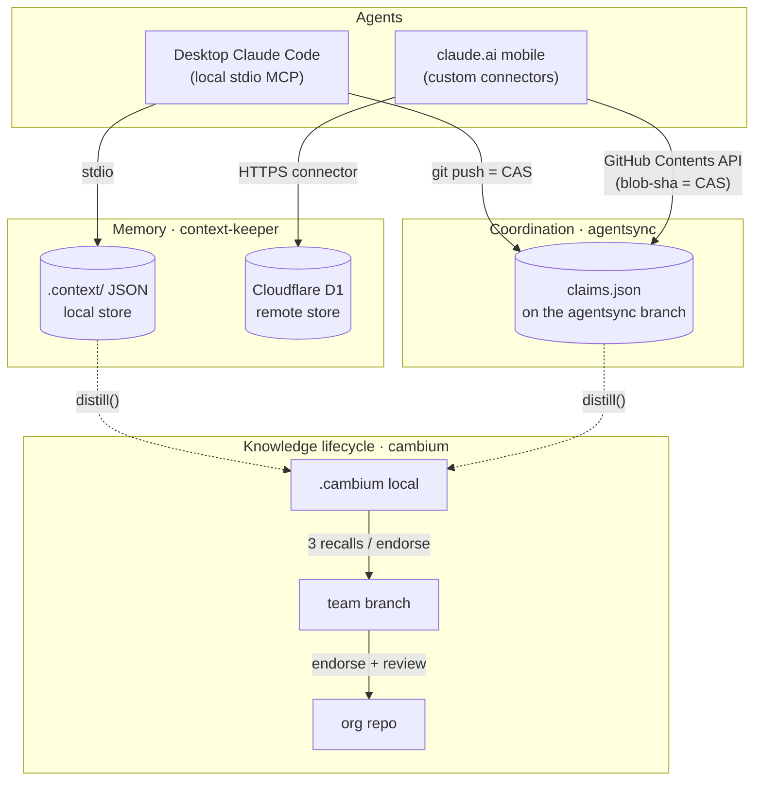

# Xylem

### 👉 [**Start with the interactive explainer →**](https://jarmstrong158.github.io/Xylem/)

A 2-minute, plain-language walkthrough of the whole stack — with an animated demo of an agent asking a question that reaches my phone. Best on mobile. *(The rest of this README is the technical deep-dive.)*

---

Xylem is the hub for a multi-agent development stack that gives AI coding agents three things they normally lack — durable **memory**, decentralized **coordination**, and a **knowledge lifecycle** — as local-first MCP servers with matching remote transports. It's built for engineers running more than one agent against the same repo (and for anyone who wants to install the tools), where the hard problems are keeping decisions from evaporating between sessions and keeping two agents from stepping on each other's work. The hook: because every remote transport is a Cloudflare Worker speaking the same protocol as the local server, **your phone becomes a full peer in your agent mesh** — it can claim work, survey what your desktop is doing, and answer a question the desktop is blocked on.

The tools are only half of it. A tool an agent *can* call but usually *doesn't* buys you nothing. So the top-level installer ships a **habit layer**: one install, and every agent on the machine remembers, coordinates, and asks by default — because the install writes the discipline into the agent's own instructions, not just the servers into its config.

> In a tree, *xylem* is the transport tissue that moves water and nutrients between layers; *cambium* is the growth layer that turns them into new wood. The names are deliberate — this repo is the transport tissue that moves you to the right tool.

## The habit layer

> **One install: agents remember, coordinate, and ask by default.**

Wiring an MCP server into a config file makes a capability *available*. It does not make an agent *use* it. An agent with a memory tool it never calls still loses the *why* behind last week's decision; two agents with a coordination tool they ignore still clobber each other. The gap between "installed" and "habitual" is where the value leaks out.

The habit layer closes that gap. Alongside registering the servers, the installer injects a fenced discipline block into your Claude Code `CLAUDE.md` and installs a `/xylem-discipline` slash command, so the behavior is part of the agent's standing instructions rather than something you have to remember to prompt for. The block is short and load-bearing:

- **Remember** — at session start a context-keeper project summary is injected via hook; active constraints are treated as binding, and settled decisions are not silently re-litigated.
- **Coordinate** — before multi-file or long-running work, survey the agentsync board and claim what you'll touch; never force over an active peer's claim without asking.
- **Ask by default** — on any judgment call with more than one defensible answer, post to the agentsync mailbox (which reaches your phone) and carry on with non-dependent work rather than guessing or blocking.
- **Record as you go** — architectural decisions land in context-keeper *at the moment they're made*, with rationale, not batched at the end.
- **Close cleanly** — before ending, record new decisions and release claims with a note stating the outcome and the next action. For a build session, "done" means *pushed to origin*, not merely committed.

Everything the installer writes lives between `<!-- XYLEM:BEGIN vN -->` / `<!-- XYLEM:END -->` fences, so it owns exactly that block and nothing else — your own `CLAUDE.md` content is never touched. Run `/xylem-discipline "<the pre-approved task>"` at the top of a session to load the full survey → claim → record → release workflow.

## Quickstart

Zero-dependency, stdlib-Python-3 installer. From a clone of this repo, with the sibling server repos (`context-keeper`, `agentsync`, `cambium`) checked out alongside it:

```sh
./install.sh --dry-run        # show exact diffs, write nothing (Windows: .\install.ps1 --dry-run)
./install.sh                  # apply: register servers + inject the habit block + hooks + slash command
```

That single run:

1. **Registers the enabled MCP servers** in your Claude Code `settings.json` — stdio for the local servers, http for the remote Workers.
2. **Injects the habit block** into `CLAUDE.md`, stamped with the current manifest version.
3. **Wires two `SessionStart` hooks** — context-keeper's memory injection, and the version check below.
4. **Installs the `/xylem-discipline` slash command.**

It's additive (never clobbers a foreign server or your prose), backs up every file before its first write as `*.xylem-backup`, and is idempotent — a second run computes identical bytes and writes nothing. Remote Worker URLs and tokens are read at install time from the environment, never committed. Target a single project's `CLAUDE.md` instead of the global one with `--project PATH`.

Prefer to wire the raw servers into a *different* editor — Cursor, Windsurf, VS Code, Claude Desktop, Zed, GitHub Copilot CLI? That's the multi-agent suite installer under [install/](install/README.md); it registers the servers across all of them but does not carry the Claude Code habit block.

## Version signals

The habit block gets sharper over time, and an install that silently goes stale is worse than no signal. So the version travels with the block:

- **`manifest.json` `"version"` (an integer) is the single source of truth.** The installer stamps the begin fence as `<!-- XYLEM:BEGIN vN -->` from that value; the current template is **v2**. A legacy unstamped block counts as v1.
- **A `SessionStart` hook (`version_check.py`) compares** the version stamped into your installed block against the template — fetching `origin` first, so the nudge fires the moment a new version is *published upstream*, before you've even pulled. If several `CLAUDE.md` copies carry a block (say a global one and one committed into a repo), the lowest wins, so any stale copy is caught.
- **On a match it prints nothing** — a current machine spends zero model tokens on the check. When you're behind, it prints one ASCII line pointing at the fix.
- **`xylem update` is that fix.** `installer.py update` git-pulls this repo and re-applies the block with the current stamp, reporting `old → new` and which files changed. It is the *only* path that rewrites a block — the check only ever detects.

## Degraded mode

Every moving part fails soft, because a coordination stack that halts your session when a piece is missing is a worse deal than no stack at all:

- **Missing remote transport?** An http server whose URL env var is unset is skipped with a warning; the local stdio servers install and work regardless. The suite is local-first — the Workers are an addition, never a dependency.
- **`available: false` servers** (e.g. the not-yet-built `context-keeper-remote`) are quietly skipped by the installer.
- **Offline, no git, or no xylem clone?** The version check fetches, finds nothing to compare, and exits silently — it never blocks a session, and any uncaught exception is swallowed to a clean exit 0.
- **No semantic-search backend?** context-keeper's optional embedding retrieval (Ollama or an OpenAI-compatible endpoint) is strictly additive and falls back to lexical search if unreachable.
- **Uncertain recall?** cambium abstains below a relevance threshold — `recall()` returns `no_confident_match` rather than confabulating.

## Uninstall

Surgical and symmetric with install:

```sh
./install.sh --uninstall --dry-run    # preview the removal
./install.sh --uninstall              # apply
```

It removes **only Xylem-owned entries** — the suite's MCP servers, both `SessionStart` hooks, the owned `env` key, and the fenced `CLAUDE.md` block — leaving foreign servers, your other hooks, and your own prose intact. The block is found by its fence markers and excised cleanly; the `/xylem-discipline` command file is deleted. Empty containers (an emptied `mcpServers`, `hooks`, or `env`) are pruned so nothing hollow is left behind.

## Manifest design

`manifest.json` is **data, not code** — the whole install is a declaration the installer interprets, so changing what ships never means touching install logic:

- **One entry per server** declares its `name`, `transport` (`stdio`/`http`), launch command/args or the env key its URL comes from, and any hook `artifacts` it owns. Adding a server, or flipping one between local and remote, is an edit here and nowhere else.
- **`available` gates each server** — flip it to `false` to ship a placeholder the installer skips, no code change.
- **`version` is the deployed-stamp source of truth** — the one integer the fence stamp and the version check both read.
- **Placeholders, not paths.** `$XYLEM_ROOT` (this repo), `$XYLEM_PARENT` (its parent, where the sibling server repos live), `$PROJECT_DIR`, and `$AGENT_ID` are resolved at install time, so the manifest is machine-agnostic.
- **No URLs, no secrets, ever.** Remote servers reference env keys (`url_env_key`, header `env_key`); the values are read from the environment at install time and never written to the file. A test asserts the manifest contains no literal `http(s)://` URL.

The manifest's shape is enforced by `tests/test_manifest.py` (stdlib `unittest`) — server set, required fields per transport, and the no-hardcoded-secrets rule all have assertions.

## Architecture

Two transports, one set of protocols. Desktop agents speak local stdio MCP and use `git push` as a compare-and-swap; claude.ai on mobile speaks the same protocols over HTTPS through Cloudflare Workers (the GitHub Contents API for coordination, D1 for memory). Both write the *same* files, so the transport is invisible to the coordination and memory logic.



The blob-sha compare-and-swap that the remote Worker gets from the GitHub Contents API maps 1:1 onto the push-based CAS the local server gets from git — which is why a phone and a desktop can share one `claims.json` without a central server ever arbitrating between them.

## The tools

### Memory — context-keeper `·` context-keeper-remote

**The problem:** across session resets and long conversations, an agent loses the *why* behind earlier choices and silently breaks patterns it established an hour ago. **The design decision:** records are rationale-first — `record_decision` *requires* a problem statement and rationale, deprecated decisions stay retrievable (so "why did we change from X?" has an answer), and scope-aware constraints re-inject at the exact moment you edit a file they cover rather than only at session start. Storage is plain human-editable JSON in `.context/` with zero required dependencies; semantic retrieval via Ollama or an OpenAI-compatible endpoint is strictly additive and falls back to lexical search if unreachable.

- **Local (Python, stdio MCP):** install the `.mcpb` bundle from Releases in Claude Desktop, or `pip install context-keeper-mcp` and point your MCP config at `server.py` with `CONTEXT_KEEPER_PROJECT` set. → [context-keeper](https://github.com/jarmstrong158/context-keeper)
- **Remote (Cloudflare Worker + D1):** the same decision/constraint/pipeline store as a claude.ai custom connector — no local server, works from mobile.
  [](https://deploy.workers.cloudflare.com/?url=https://github.com/jarmstrong158/context-keeper-remote)
  → [context-keeper-remote](https://github.com/jarmstrong158/context-keeper-remote)

### Coordination — agentsync `·` agentsync-remote

**The problem:** two agents editing the same repo at once corrupt each other's work, and there's no server you'd want to stand up just to referee them. **The design decision:** there is no server. Coordination is a single `claims.json` on a dedicated `agentsync` branch; each agent declares what it's building, which files it `touches`, and what it `requires`, then writes with a fetch-read-validate-push loop where **`git push` is the compare-and-swap** — a rejected push means someone else claimed first, so the agent re-syncs and re-evaluates. Overlap detection is path-aware (exact match, directory containment, and globs, so `src/api` blocks `src/api/routes.py`), and conflicts are surfaced at two levels: declared-intent intersection and a `git merge-tree` dry run for textual collisions. It's textual, not semantic — it tells you two files won't merge, not that an API contract broke.

- **Local (Python, stdio MCP):** `pip install -r requirements.txt` then `gh auth login`; configure the server with your repo clone path and a unique agent id. → [agentsync](https://github.com/jarmstrong158/agentsync)
- **Remote (Cloudflare Worker):** the identical protocol over the GitHub Contents API, so claude.ai mobile joins the same mesh with no git or local checkout — plus a `mailbox` tool for human-in-the-loop notes between devices.
  [](https://deploy.workers.cloudflare.com/?url=https://github.com/jarmstrong158/agentsync-remote)
  → [agentsync-remote](https://github.com/jarmstrong158/agentsync-remote)

### Knowledge lifecycle — cambium

**The problem:** the knowledge an agent accumulates while working is real, but most of it is worth remembering only locally, and only some earns a place at team or org scope. **The design decision:** cambium is a growth layer over the other two substrates — it `distill()`s completed work (agentsync events + context-keeper decisions) into memory by passive observation, serves it back through one `recall()` endpoint for any agent type, and promotes it by trust: local → team at 3 recalls or one endorsement, team → org only with an endorsement plus optional PR review. Like the rest of the stack it stores in git rather than a new database (`.cambium/knowledge.json` locally, a `cambium` branch for team, a separate repo for org), and it abstains — below a relevance threshold `recall()` returns `no_confident_match` instead of confabulating. It's honest about its limits: claims completed and re-claimed between distill runs can be lost, a deliberate trade of completeness for simplicity.

- **Install (Python, stdio MCP):** `pip install mcp`, then configure the repo path, agent id, and optional org-repo location; capture hooks call `distill()` at session-end / post-commit. → [cambium](https://github.com/jarmstrong158/cambium)

## Cross-transport walkthrough

The point of the two transports is that a phone is a first-class peer, not a viewer. A concrete loop:

1. **PC agent claims work.** Your desktop Claude Code agent calls `claim("refactor auth middleware", touches=["src/auth/**"])`. The claim is written to `claims.json` via `git push` — CAS succeeds, so the slice is now yours.
2. **Phone surveys and sees it.** From claude.ai on your phone, the agentsync-remote connector calls `survey()`. It reads the *same* `claims.json` through the GitHub Contents API and shows the active claim on `src/auth/**`, its age, and its status — no git, no checkout on the device.
3. **Phone answers a mailbox question.** The desktop agent hit an ambiguity ("prefer JWT rotation or short-lived sessions?") and left it as a `mailbox` note. On the phone you read it and reply through the same tool; the answer lands in the shared coordination file.
4. **PC proceeds.** The desktop agent's next `survey()`/`check_conflicts()` picks up your reply, unblocks, finishes the slice, and marks the claim done. Meanwhile cambium's `distill()` quietly captures the decision and its rationale for next time.

One mesh, two devices, no central server between them.

## Design principles

The recurring decisions across all five repos — rationale-first records, no central server, CAS over locks, local-first with remote transports, and fail-closed auth — are written up in [docs/design-principles.md](docs/design-principles.md).

## Related projects

Other things built by the same author:

- **[waveform-mcp](https://github.com/jarmstrong158/waveform-mcp)** — an MCP server with 150+ tools for composing, arranging, mixing, and rendering music inside the Tracktion Waveform DAW.
- **[skillmatch-mcp](https://github.com/jarmstrong158/skillmatch-mcp)** — an MCP server that analyzes job fit from your GitHub portfolio and resume and manages applications in a local database.
- **[Conductor](https://github.com/jarmstrong158/Conductor)** — a local task-automation tool for scheduled workers, multi-step pipelines, and email notifications, driven by a dashboard and natural language.
- **[Skein](https://github.com/jarmstrong158/Skein)** — a local-first debugger for multi-agent A2A systems that captures inter-agent traffic to SQLite and lets you debug it conversationally through Claude.
- **[rag-pipeline](https://github.com/jarmstrong158/rag-pipeline)** — a fully local retrieval-augmented generation system for asking questions grounded in your own documents, no API keys or cloud required.
- **[Clark](https://github.com/jarmstrong158/Clark)** — a foundation reinforcement-learning model for warehouse workforce scheduling using a transformer-LSTM hybrid that generalizes across facilities.
- **[Balatron](https://github.com/jarmstrong158/Balatron)** — an autonomous agent that plays the roguelike *Balatro* by combining PPO, forward-planning search, and heuristic tactics.
