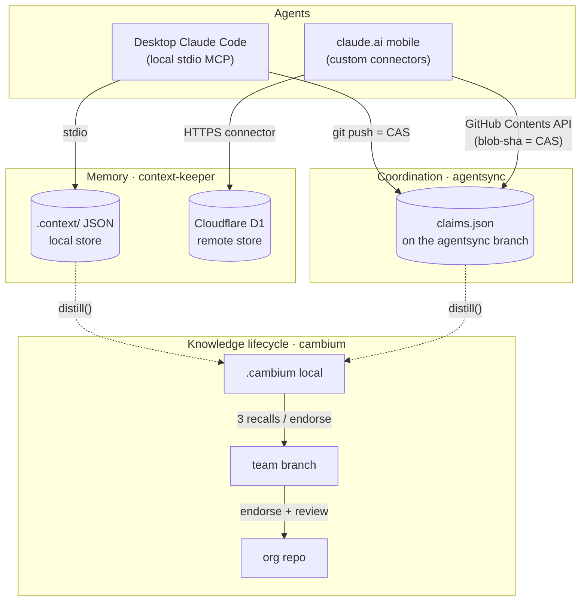

# Xylem

### 👉 [**Start with the interactive explainer →**](https://jarmstrong158.github.io/Xylem/)

A 2-minute, plain-language walkthrough of the whole stack — with an animated demo of an agent asking a question that reaches my phone. Best on mobile. *(The rest of this README is the technical deep-dive.)*

---

Xylem is the hub for a multi-agent development stack that gives AI coding agents three things they normally lack — durable **memory**, decentralized **coordination**, and a **knowledge lifecycle** — as local-first MCP servers with matching remote transports. It's built for engineers running more than one agent against the same repo (and for anyone who wants to install the tools), where the hard problems are keeping decisions from evaporating between sessions and keeping two agents from stepping on each other's work. The hook: because every remote transport is a Cloudflare Worker speaking the same protocol as the local server, **your phone becomes a full peer in your agent mesh** — it can claim work, survey what your desktop is doing, and answer a question the desktop is blocked on.

> In a tree, *xylem* is the transport tissue that moves water and nutrients between layers; *cambium* is the growth layer that turns them into new wood. The names are deliberate — this repo is the transport tissue that moves you to the right tool.

## Architecture

Two transports, one set of protocols. Desktop agents speak local stdio MCP and use `git push` as a compare-and-swap; claude.ai on mobile speaks the same protocols over HTTPS through Cloudflare Workers (the GitHub Contents API for coordination, D1 for memory). Both write the *same* files, so the transport is invisible to the coordination and memory logic.



The blob-sha compare-and-swap that the remote Worker gets from the GitHub Contents API maps 1:1 onto the push-based CAS the local server gets from git — which is why a phone and a desktop can share one `claims.json` without a central server ever arbitrating between them.

## Install

One zero-dependency (stdlib Python 3) installer wires the whole suite into whatever coding agents you already have — Claude Code, Cursor, Windsurf, VS Code, Claude Desktop, Zed, GitHub Copilot CLI — handling both transports: stdio for the local servers, HTTP for the remote Workers.

```sh
cp install/xylem.config.example.json install/xylem.config.json   # fill in paths + Worker URLs (gitignored)
./install.sh                    # dry-run: show exactly what would change (Windows: .\install.ps1)
./install.sh install --apply    # write it
```

It's additive (never clobbers an existing server), backs up before every write, is idempotent, and ships a surgical `uninstall`. Worker URLs and tokens are read at install time from your untracked config or the environment — never committed. Details and the per-agent config paths it touches: **[install/README.md](install/README.md)**. Prefer to wire one tool by hand? Each per-tool install line is below.

## The tools

### Memory — context-keeper `·` context-keeper-remote

**The problem:** across session resets and long conversations, an agent loses the *why* behind earlier choices and silently breaks patterns it established an hour ago. **The design decision:** records are rationale-first — `record_decision` *requires* a problem statement and rationale, deprecated decisions stay retrievable (so "why did we change from X?" has an answer), and scope-aware constraints re-inject at the exact moment you edit a file they cover rather than only at session start. Storage is plain human-editable JSON in `.context/` with zero required dependencies; semantic retrieval via Ollama or an OpenAI-compatible endpoint is strictly additive and falls back to lexical search if unreachable.

- **Local (Python, stdio MCP):** install the `.mcpb` bundle from Releases in Claude Desktop, or `pip install context-keeper-mcp` and point your MCP config at `server.py` with `CONTEXT_KEEPER_PROJECT` set. → [context-keeper](https://github.com/jarmstrong158/context-keeper)
- **Remote (Cloudflare Worker + D1):** the same decision/constraint/pipeline store as a claude.ai custom connector — no local server, works from mobile.
  [](https://deploy.workers.cloudflare.com/?url=https://github.com/jarmstrong158/context-keeper-remote)
  → [context-keeper-remote](https://github.com/jarmstrong158/context-keeper-remote)

### Coordination — agentsync `·` agentsync-remote

**The problem:** two agents editing the same repo at once corrupt each other's work, and there's no server you'd want to stand up just to referee them. **The design decision:** there is no server. Coordination is a single `claims.json` on a dedicated `agentsync` branch; each agent declares what it's building, which files it `touches`, and what it `requires`, then writes with a fetch-read-validate-push loop where **`git push` is the compare-and-swap** — a rejected push means someone else claimed first, so the agent re-syncs and re-evaluates. Overlap detection is path-aware (exact match, directory containment, and globs, so `src/api` blocks `src/api/routes.py`), and conflicts are surfaced at two levels: declared-intent intersection and a `git merge-tree` dry run for textual collisions. It's textual, not semantic — it tells you two files won't merge, not that an API contract broke.

- **Local (Python, stdio MCP):** `pip install -r requirements.txt` then `gh auth login`; configure the server with your repo clone path and a unique agent id. → [agentsync](https://github.com/jarmstrong158/agentsync)
- **Remote (Cloudflare Worker):** the identical protocol over the GitHub Contents API, so claude.ai mobile joins the same mesh with no git or local checkout — plus a `mailbox` tool for human-in-the-loop notes between devices.
  [](https://deploy.workers.cloudflare.com/?url=https://github.com/jarmstrong158/agentsync-remote)
  → [agentsync-remote](https://github.com/jarmstrong158/agentsync-remote)

### Knowledge lifecycle — cambium

**The problem:** the knowledge an agent accumulates while working is real, but most of it is worth remembering only locally, and only some earns a place at team or org scope. **The design decision:** cambium is a growth layer over the other two substrates — it `distill()`s completed work (agentsync events + context-keeper decisions) into memory by passive observation, serves it back through one `recall()` endpoint for any agent type, and promotes it by trust: local → team at 3 recalls or one endorsement, team → org only with an endorsement plus optional PR review. Like the rest of the stack it stores in git rather than a new database (`.cambium/knowledge.json` locally, a `cambium` branch for team, a separate repo for org), and it abstains — below a relevance threshold `recall()` returns `no_confident_match` instead of confabulating. It's honest about its limits: claims completed and re-claimed between distill runs can be lost, a deliberate trade of completeness for simplicity.

- **Install (Python, stdio MCP):** `pip install mcp`, then configure the repo path, agent id, and optional org-repo location; capture hooks call `distill()` at session-end / post-commit. → [cambium](https://github.com/jarmstrong158/cambium)

## Cross-transport walkthrough

The point of the two transports is that a phone is a first-class peer, not a viewer. A concrete loop:

1. **PC agent claims work.** Your desktop Claude Code agent calls `claim("refactor auth middleware", touches=["src/auth/**"])`. The claim is written to `claims.json` via `git push` — CAS succeeds, so the slice is now yours.
2. **Phone surveys and sees it.** From claude.ai on your phone, the agentsync-remote connector calls `survey()`. It reads the *same* `claims.json` through the GitHub Contents API and shows the active claim on `src/auth/**`, its age, and its status — no git, no checkout on the device.
3. **Phone answers a mailbox question.** The desktop agent hit an ambiguity ("prefer JWT rotation or short-lived sessions?") and left it as a `mailbox` note. On the phone you read it and reply through the same tool; the answer lands in the shared coordination file.
4. **PC proceeds.** The desktop agent's next `survey()`/`check_conflicts()` picks up your reply, unblocks, finishes the slice, and marks the claim done. Meanwhile cambium's `distill()` quietly captures the decision and its rationale for next time.

One mesh, two devices, no central server between them.

## Design principles

The recurring decisions across all five repos — rationale-first records, no central server, CAS over locks, local-first with remote transports, and fail-closed auth — are written up in [docs/design-principles.md](docs/design-principles.md).

## Related projects

Other things built by the same author:

- **[waveform-mcp](https://github.com/jarmstrong158/waveform-mcp)** — an MCP server with 150+ tools for composing, arranging, mixing, and rendering music inside the Tracktion Waveform DAW.
- **[skillmatch-mcp](https://github.com/jarmstrong158/skillmatch-mcp)** — an MCP server that analyzes job fit from your GitHub portfolio and resume and manages applications in a local database.
- **[Conductor](https://github.com/jarmstrong158/Conductor)** — a local task-automation tool for scheduled workers, multi-step pipelines, and email notifications, driven by a dashboard and natural language.
- **[Skein](https://github.com/jarmstrong158/Skein)** — a local-first debugger for multi-agent A2A systems that captures inter-agent traffic to SQLite and lets you debug it conversationally through Claude.
- **[rag-pipeline](https://github.com/jarmstrong158/rag-pipeline)** — a fully local retrieval-augmented generation system for asking questions grounded in your own documents, no API keys or cloud required.
- **[Clark](https://github.com/jarmstrong158/Clark)** — a foundation reinforcement-learning model for warehouse workforce scheduling using a transformer-LSTM hybrid that generalizes across facilities.
- **[Balatron](https://github.com/jarmstrong158/Balatron)** — an autonomous agent that plays the roguelike *Balatro* by combining PPO, forward-planning search, and heuristic tactics.
