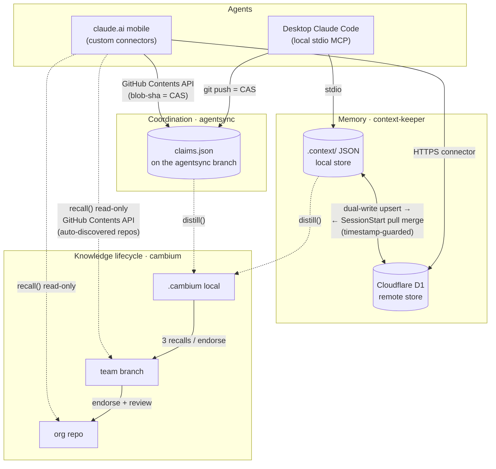

# Xylem

[](https://github.com/jarmstrong158/Xylem/actions/workflows/tests.yml)
[](LICENSE)
[](#requirements)

**Xylem gives AI coding agents durable memory, decentralized coordination, and a knowledge lifecycle — and makes them use it by default.**

Three local-first MCP servers, each with a Cloudflare Worker that speaks the identical protocol. Because the transports match, your phone is a full peer in the mesh: it can claim work, survey what your desktop is doing, recall the team's distilled knowledge, and answer a question the desktop is blocked on.

It's for engineers running more than one agent against the same repo, where decisions evaporate between sessions and two agents clobber each other's files.

```text
/plugin marketplace add jarmstrong158/Xylem
/plugin install xylem@xylem-stack
```

[**Interactive explainer**](https://jarmstrong158.github.io/Xylem/) · [**Live dashboard**](https://jarmstrong158.github.io/Xylem/dashboard.html) · [Design principles](docs/design-principles.md) · [Decision log](DECISIONS.md)

> **Status:** personal project, actively used against my own work. Manifest template v4, plugin 0.2.0. Interfaces are still moving. Issues welcome; PRs by discussion first.

---

## The repo map

The stack is seven repos. This one is the hub — it installs the others and carries the habit layer.

| Repo | Role | Transport |
|---|---|---|
| **Xylem** (here) | Installer, habit layer, plugin marketplace | — |
| [context-keeper](https://github.com/jarmstrong158/context-keeper) | Decision memory — the canonical store | local stdio |
| [context-keeper-remote](https://github.com/jarmstrong158/context-keeper-remote) | Same store, Cloudflare Worker + D1 | remote http |
| [agentsync](https://github.com/jarmstrong158/agentsync) | Claim/release coordination board | local stdio |
| [agentsync-remote](https://github.com/jarmstrong158/agentsync-remote) | Same board via GitHub Contents API, plus `mailbox` | remote http |
| [cambium](https://github.com/jarmstrong158/cambium) | Knowledge lifecycle over the other two | local stdio |
| [cambium-remote](https://github.com/jarmstrong158/cambium-remote) | Read-only `recall()` of team + org knowledge, auto-discovering repos | remote http |

## The tools

### Memory — context-keeper `·` context-keeper-remote

**The problem:** across session resets and long conversations, an agent loses the *why* behind earlier choices and silently breaks patterns it established an hour ago.

**The design decision:** records are rationale-first. `record_decision` *requires* a problem statement and rationale, deprecated decisions stay retrievable (so "why did we change from X?" has an answer), and scope-aware constraints re-inject at the moment you edit a file they cover rather than only at session start. Storage is plain human-editable JSON in `.context/` with zero required dependencies. Semantic retrieval via Ollama or an OpenAI-compatible endpoint is strictly additive and falls back to lexical search if unreachable.

**The mirror (local ⇄ remote).** The local `.context/` store is canonical; the D1-backed Worker mirrors it so the same memory reaches your phone. Every local write pushes to the remote as a `mirror` upsert; `SessionStart` pulls and merges entries that are newer on the remote. The upsert is timestamp-guarded, so edits flow both ways and the newer version wins.

The honest caveat: two edits to the same entry within the resolution of the timestamps — sub-second, cross-device — can misorder under clock skew, since the guard only has wall-clock to break the tie. Whenever the guard overwrites a version, the displaced copy is appended to `.mirror_conflicts.json`, so nothing is silently lost and you can reconcile by hand.

### Coordination — agentsync `·` agentsync-remote

**The problem:** two agents editing the same repo at once corrupt each other's work, and there's no server you'd want to stand up just to referee them.

**The design decision:** there is no server. Coordination is a single `claims.json` on a dedicated `agentsync` branch. Each agent declares what it's building, which files it `touches`, and what it `requires`, then writes with a fetch-read-validate-push loop where **`git push` is the compare-and-swap** — a rejected push means someone else claimed first, so the agent re-syncs and re-evaluates. Overlap detection is path-aware (exact match, directory containment, and globs, so `src/api` blocks `src/api/routes.py`), and conflicts surface at two levels: declared-intent intersection, and a `git merge-tree` dry run for textual collisions.

It's textual, not semantic — it tells you two files won't merge, not that an API contract broke.

### Knowledge lifecycle — cambium

**The problem:** the knowledge an agent accumulates while working is real, but most of it is worth remembering only locally, and only some earns a place at team or org scope.

**The design decision:** cambium is a growth layer over the other two substrates. It `distill()`s completed work (agentsync events + context-keeper decisions) into memory by passive observation, serves it back through one `recall()` endpoint for any agent type, and promotes it by trust: local → team at 3 recalls or one endorsement; team → org only with an endorsement plus optional PR review. Like the rest of the stack it stores in git rather than a new database — `.cambium/knowledge.json` locally, a `cambium` branch for team, a separate repo for org — and it abstains: below a relevance threshold `recall()` returns `no_confident_match` instead of confabulating.

Its stated limit: claims completed *and* re-claimed between distill runs can be lost, a deliberate trade of completeness for simplicity.

**On the phone (cambium-remote).** A read-only Cloudflare Worker serves `recall()` over **team + org** knowledge to claude.ai, so the lesson the team already learned reaches you on mobile — not just your desktop. It reads the same `cambium` team branches and the org repo through the GitHub Contents API, and it **auto-discovers** which repos have been team-promoted rather than carrying a static list, so a growing knowledge base needs no reconfiguration. Recall is the whole surface on mobile: local (personal, unpromoted) scope and the write side — `distill()` and `promote()` — stay desktop-only.

## Architecture

Two transports, one set of protocols. Desktop agents speak local stdio MCP and use `git push` as a compare-and-swap; claude.ai on mobile speaks the same protocols over HTTPS through Cloudflare Workers (the GitHub Contents API for coordination and knowledge recall, D1 for memory). Both write the *same* files, so the transport is invisible to the logic above it. The one asymmetry is deliberate: knowledge recall reaches mobile read-only, while the writes that grow the knowledge base — `distill()` and `promote()` — stay on the desktop.



The blob-sha compare-and-swap the remote Worker gets from the GitHub Contents API maps 1:1 onto the push-based CAS the local server gets from git — which is why a phone and a desktop can share one `claims.json` without a central server ever arbitrating between them.

## Cross-transport walkthrough

The point of the two transports is that a phone is a first-class peer, not a viewer.

1. **PC agent claims work.** Your desktop agent calls `claim("refactor auth middleware", touches=["src/auth/**"])`. The claim is written to `claims.json` via `git push` — CAS succeeds, so the slice is yours.
2. **Phone surveys and sees it.** From claude.ai on your phone, the agentsync-remote connector calls `survey()`. It reads the *same* `claims.json` through the GitHub Contents API and shows the active claim, its age, and its status — no git, no checkout on the device.
3. **Phone answers a mailbox question.** The desktop agent hit an ambiguity ("prefer JWT rotation or short-lived sessions?") and left it as a `mailbox` note. You read it on the phone and reply through the same tool; the answer lands in the shared coordination file.
4. **PC proceeds.** The desktop agent's next `survey()` picks up your reply, unblocks, finishes the slice, and marks the claim done. cambium's `distill()` captures the decision and its rationale for next time.

One mesh, two devices, no central server between them.

## The habit layer

Registering an MCP server makes a capability available. It doesn't make an agent use it — an agent with a memory tool it never calls still loses the *why* behind last week's decision, and two agents with a coordination tool they ignore still clobber each other.

So the installer also writes the discipline into the agent's own instructions: a fenced block in your Claude Code `CLAUDE.md` plus a `/xylem-discipline` slash command. The behavior becomes part of the agent's standing instructions rather than something you have to remember to prompt for.

- **Remember** — a context-keeper project summary is injected at session start; active constraints are binding, and settled decisions are not silently re-litigated.
- **Recall & compound** — `recall()` what the team already learned before starting; a `SessionEnd` hook `distill()`s finished claims and decisions back into cambium.
- **Coordinate** — survey the board and claim what you'll touch before multi-file work; never force over an active peer's claim without asking.
- **Ask by default** — on any judgment call with more than one defensible answer, post to the agentsync mailbox (which reaches your phone) and carry on with non-dependent work.
- **Record as you go** — architectural decisions land in context-keeper at the moment they're made, with rationale.
- **Close cleanly** — release claims with a note stating the outcome and the next action. For a build session, "done" means *pushed to origin*.

Everything the installer writes lives between `<!-- XYLEM:BEGIN vN -->` / `<!-- XYLEM:END -->` fences, so it owns exactly that block and nothing else. The prose is generated from a single source (`artifacts/discipline.source.json`) into all three of its destinations, and a test fails if any copy drifts.

## Install

### As a Claude Code plugin — no clone required

```text
/plugin marketplace add jarmstrong158/Xylem
/plugin install xylem@xylem-stack
```

Ships seven skills, the `SessionStart`/`SessionEnd` hooks, and the two **remote** MCP servers. Set `CONTEXT_KEEPER_REMOTE_URL` and `AGENTSYNC_REMOTE_URL` to your deployed Workers' connector URLs.

> These Workers authenticate on the URL path (`.../mcp/<token>`), so **the whole URL is the credential** — treat it like a password. There is no separate token env var; a `Bearer` header is never read. See [docs/manifest.md](docs/manifest.md#auth).

The plugin path is remote-only: it does **not** install the local stdio servers, and it has no local memory if you haven't deployed the Workers. [plugin/README.md](plugin/README.md) has the full comparison table.

A third Worker, **cambium-remote**, is read-only and stateless, so it isn't wired into the plugin's env: you add its `.../mcp/<token>` URL directly as a custom connector on claude.ai to get team + org `recall()` on mobile. It needs a GitHub token (`GH_PAT`) plus `ORG_REPO` and `TEAM_OWNER` set on the Worker; see [cambium-remote](https://github.com/jarmstrong158/cambium-remote) for its config.

Don't have the Workers yet? One click each:

[](https://deploy.workers.cloudflare.com/?url=https://github.com/jarmstrong158/context-keeper-remote)
[](https://deploy.workers.cloudflare.com/?url=https://github.com/jarmstrong158/agentsync-remote)
[](https://deploy.workers.cloudflare.com/?url=https://github.com/jarmstrong158/cambium-remote)

### As a full local-first install — the habit layer

Zero-dependency, stdlib Python 3.8+. Clone this repo and run the installer — it clones the sibling server repos (`context-keeper`, `agentsync`, `cambium`) for you on first `--apply`:

```sh
git clone https://github.com/jarmstrong158/Xylem
cd Xylem
./install.sh                  # preview: show exact diffs + which servers it will clone
./install.sh --apply          # clone the servers, then wire everything up
```

On Windows use `.\install.ps1` with the same flags.

The servers are cloned as siblings of this repo (into the parent directory), which is exactly where the manifest resolves them. Already have them checked out? The clone step sees them and skips. Prefer to manage the checkouts yourself? Pass `--no-fetch` and clone them by hand. Point the installer at a fork or mirror with `XYLEM_SOURCE_BASE`.

That run registers the enabled MCP servers in your Claude Code `settings.json`, injects the version-stamped habit block into `CLAUDE.md`, wires the three hooks, and installs the `/xylem-discipline` command. It's additive, backs up every file before its first write as `*.xylem-backup`, preserves your file's existing indentation and line endings, and is idempotent. Target one project's `CLAUDE.md` instead of the global one with `--project PATH`.

**Verify it worked:** `./install.sh doctor` reports, per server, whether it can actually start — the stdio server's script is present and parses and your interpreter can import `mcp`; the optional remotes report whether their URL is set. It exits non-zero if any required server is broken, so it doubles as a post-install / CI gate.

```text
xylem doctor -- interpreter: /usr/bin/python3 (mcp: yes)

  [OK  ] context-keeper         .../context-keeper/server.py
  [OK  ] agentsync              .../agentsync/agentsync_server.py
  [WARN] agentsync-remote       AGENTSYNC_REMOTE_URL unset -- optional remote not registered
  [OK  ] cambium                .../cambium/cambium_server.py
  [WARN] context-keeper-remote  CONTEXT_KEEPER_REMOTE_URL unset -- optional remote not registered
```

Both installers in this repo **preview by default and require `--apply` to write**. (They used to ship opposite defaults under the same filename; that's fixed. `--dry-run` is still accepted, so older command lines behave identically.)

Uninstall is symmetric — `./install.sh --uninstall --apply` removes only Xylem-owned entries, leaving foreign servers, your other hooks, and your own prose intact. Hooks Xylem writes are tagged, so an unrelated tool's `session_start_hook.py` is never mistaken for one of ours.

### Into a different editor

Cursor, Windsurf, VS Code, Claude Desktop, Zed, GitHub Copilot CLI: that's the multi-agent suite installer under [install/](install/README.md). It registers the servers across all of them but does not carry the Claude Code habit block.

## Requirements

- **Python 3.8+** for the installer (stdlib only, no dependencies). The MCP servers themselves need 3.10+ and `pip install mcp`.
- **git** for coordination — agentsync uses `git push` as its compare-and-swap.
- **macOS, Linux, or Windows.** CI runs the suite on all three.
- **Optional:** a Cloudflare account if you want the remote transports; Ollama or an OpenAI-compatible endpoint if you want semantic retrieval. Neither is required.

## Tests

75+ stdlib `unittest` tests, no dependencies, run on three platforms in CI:

```sh
python -m unittest discover -s tests -v
```

They cover the fence round-trip, hook merge/removal, config merge, the version check, the manifest's shape (including an assertion that no literal URL or auth header can be committed), an end-to-end install against a temp HOME asserting idempotency and that uninstall restores the original bytes, and a drift guard that fails if any generated artifact falls out of sync with its source.

## Why not just…

| Instead of Xylem | Why it isn't enough |
|---|---|
| **A `CLAUDE.md` you maintain by hand** | It holds instructions, not a queryable record. It can't tell you *why* you rejected an option six weeks ago, and nothing keeps two agents off the same file. |
| **A shared Notion / wiki** | Nothing writes to it automatically, so it decays. Xylem captures decisions at the moment they're made and distills finished work with no human in the loop. |
| **Git branches per agent** | Branches isolate *output*; they don't stop two agents from planning the same work. agentsync coordinates *intent* before the edits happen. |
| **A coordination service** | It's a thing to run, secure, and pay for. Coordination here is a JSON file on a branch, using `git push` as the lock. |

## Proven in use

The stack runs against my own work, and the evidence is in this repo rather than in a claim:

- **[DECISIONS.md](DECISIONS.md)** is the decision log for Xylem itself, recorded through context-keeper as the work happened — including the ones where a test-install caught what validation missed.
- **The [live dashboard](https://jarmstrong158.github.io/Xylem/dashboard.html)** renders real coordination traffic from the mesh. Read it honestly: it's one operator on two devices (`jonny-desktop`, `jonny-mobile`), not a team.
- **[Balatron](https://github.com/jarmstrong158/Balatron)** went through a full audit → fix → re-measure cycle with the decisions and rationale captured in context-keeper as they were made.

## Docs

- [Design principles](docs/design-principles.md) — the five decisions that recur across the suite
- [Decision log](DECISIONS.md) — dated, rationale-first, newest last
- [Manifest design](docs/manifest.md) — how the install is declared, and how auth works
- [Version signals](docs/versioning.md) — the version stamp, the update path, the trust boundary
- [Degraded mode](docs/degraded-mode.md) — what happens when a piece is missing, and what *isn't* covered
- [Multi-editor installer](install/README.md) · [Plugin](plugin/README.md)

## Security

- The remote connector URL **is** the credential (path-token auth). Treat it like a password; rotating the token invalidates every prior URL. Install-time values come from the environment and are never committed — a test enforces this.
- `--dry-run` output redacts URL path tokens, so a preview is safe to paste into an issue.
- agentsync-remote's GitHub token is scoped to Contents read/write on the coordination repo only.
- `xylem update` git-pulls and the pulled hooks then execute every session — a real trust boundary, documented in [docs/versioning.md](docs/versioning.md#trust-boundary).
- The dashboard generator scrubs home directories from any text it publishes, and `--no-notes` omits note bodies entirely.

## License

MIT — see [LICENSE](LICENSE).
